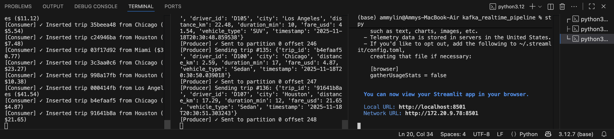
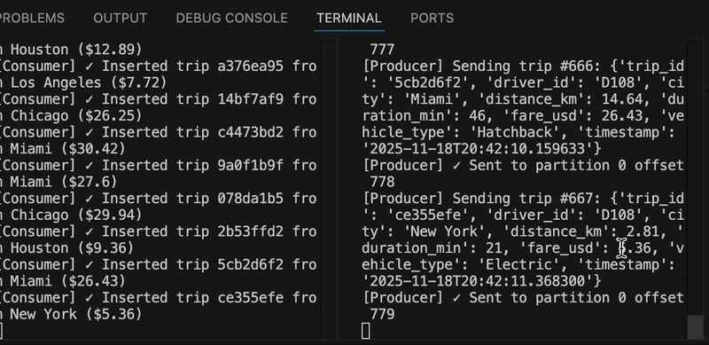
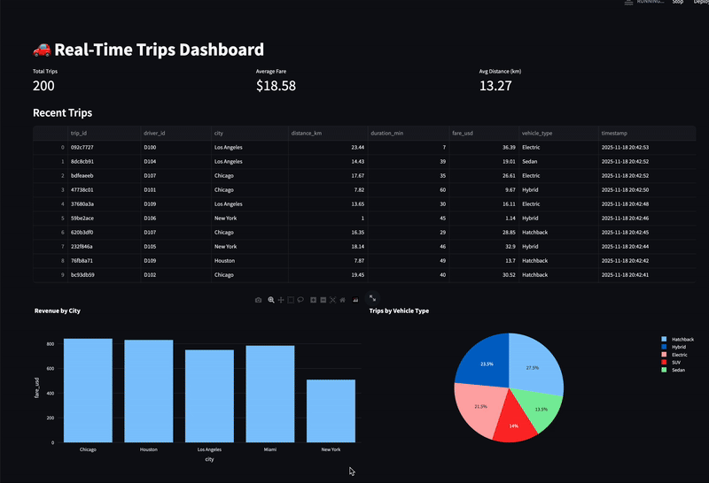

# Real-Time Trip Streaming System

This project demonstrates a **real-time streaming data pipeline** for ride-sharing trips. It demonstrates how real-time data streaming can be implemented end-to-end, allowing for live monitoring of events as they occur, and shows the integration of Kafka, PostgreSQL, and Streamlit for data pipelines. It generates synthetic trip events, streams them via **Apache Kafka**, stores them in **PostgreSQL**, and visualizes live updates in a **Streamlit dashboard**.

## Prerequisites
- Docker & Docker Compose
- Python 3.12+
- PostgreSQL (via Docker container)
- Kafka (via Docker container)

---

## Producer Implementation

- Generates synthetic ride-sharing trip data (pickup/dropoff, distance, fare, payment method, status).  
- Sends events continuously to Kafka topic `trips`.  
- Configurable for number of trips per second and data variability.

---

## Kafka Configuration & Streaming

- Kafka broker configured via Docker Compose (`confluentinc/cp-kafka:7.4.0`).  
- Producer publishes to topic `trips`.  
- Topic is created with 1 partition and replication factor of 1 (adjustable).  
- Consumer reads from topic in real time.

---

## Consumer Functionality

- Consumes events from Kafka topic `trips`.  
- Parses incoming messages and stores them in PostgreSQL.  
- Handles message offsets correctly to ensure no data is lost.  

---

## Database Schema & Persistence

- PostgreSQL database `kafka_db`.  
- Table `trips` schema:

| Column         | Type         | Description                    |
|----------------|--------------|--------------------------------|
| trip_id        | SERIAL       | Unique trip identifier         |
| pickup_time    | TIMESTAMP    | Trip start time                |
| dropoff_time   | TIMESTAMP    | Trip end time                  |
| pickup_location| VARCHAR      | Pickup location                |
| dropoff_location| VARCHAR     | Dropoff location               |
| distance       | FLOAT        | Trip distance in km            |
| fare           | FLOAT        | Fare amount                    |
| payment_method | VARCHAR      | Payment method (card, cash…)   |
| status         | VARCHAR      | Completed, canceled, in-progress|

- Data persists across consumer restarts.

---

## Data Flow Integration
[Trip Producer] --> [Kafka Topic: trips] --> [Kafka Consumer] --> [PostgreSQL] --> [Streamlit Dashboard]

- Producer streams synthetic trips → Kafka topic.  
- Consumer stores events in PostgreSQL.  
- Dashboard fetches from PostgreSQL for live metrics.  

---

## Real-Time Dashboard Operation

- Built using Streamlit (`trips_dashboard.py`).  
- Live auto-refreshing charts:  
  - Total trips  
  - Total revenue  
  - Average distance  
  - Trips by status  
  - Payment method distribution  
- Dashboard updates as events are produced in real time.

**Screenshots & GIFs:**  




  

*Shows trips streaming live and metrics updating dynamically.*

---

## Creativity & Other Modifications

- Changed data domain from e-commerce orders to ride-sharing trips.  
- Added additional metrics: average distance, payment method distribution.  
- Modular Python scripts for producer, consumer, and dashboard.

---

## Documentation Quality

- Clear setup instructions: Docker Compose, Python dependencies, environment variables.  
- Step-by-step instructions for running the producer, consumer, and dashboard.  
- Screenshots and GIF demonstrate real-time updates.  
- Comments in code for clarity and maintainability.

---

## Setup and Running

### Install dependencies:

Start Kafka & PostgreSQL:
```
docker-compose up -d
```

Run Producer:
```
python producer_trips.py
```

Run Consumer:
```
python consumer_trips.py
```
Launch Dashboard:
```
streamlit run trips_dashboard.py
```

Dashboard opens at http://localhost:8501.